<h1 align="center">Hi, I'm Kimly John 👋</h1>
<h3 align="center">Software Engineering Student | Web Development, Mobile Development & AI</h3>

## About Me
- I'm a 3rd-year Software Engineering student, currently focusing on full-stack web development, mobile development, and exploring AI/ML concepts.
- Actively developing my skills through academic coursework, algorithms, and personal projects.
- Preparing for upcoming software engineering internships and part-time roles.
- Always open to collaborating on open-source projects or hackathons.

## Tech Stack

  
  
  
  
  
  
  
  
  
  

## Let's Connect

  
  

---

## GitHub Activity & Stats
An overview of my top languages, lines of code, and contributions.

  

